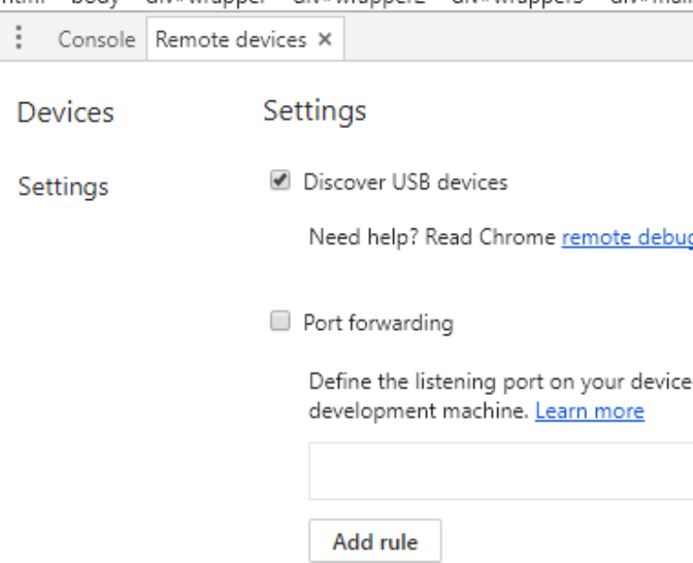
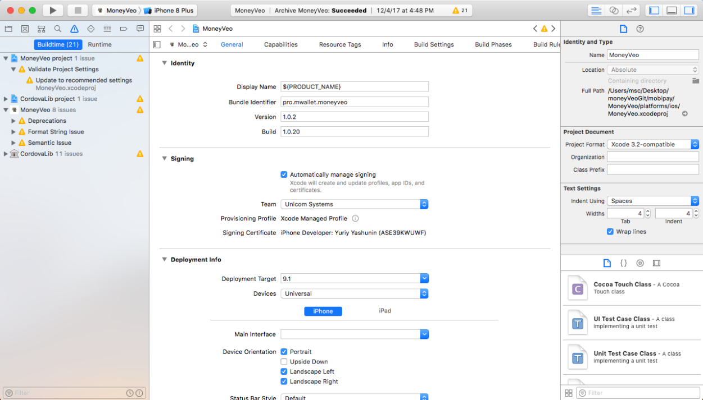
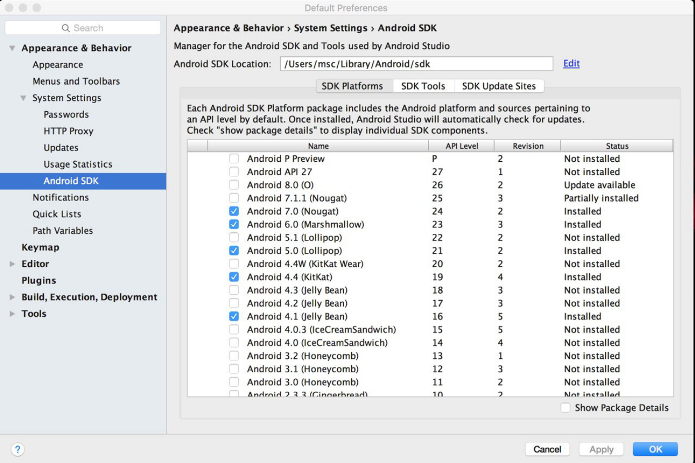
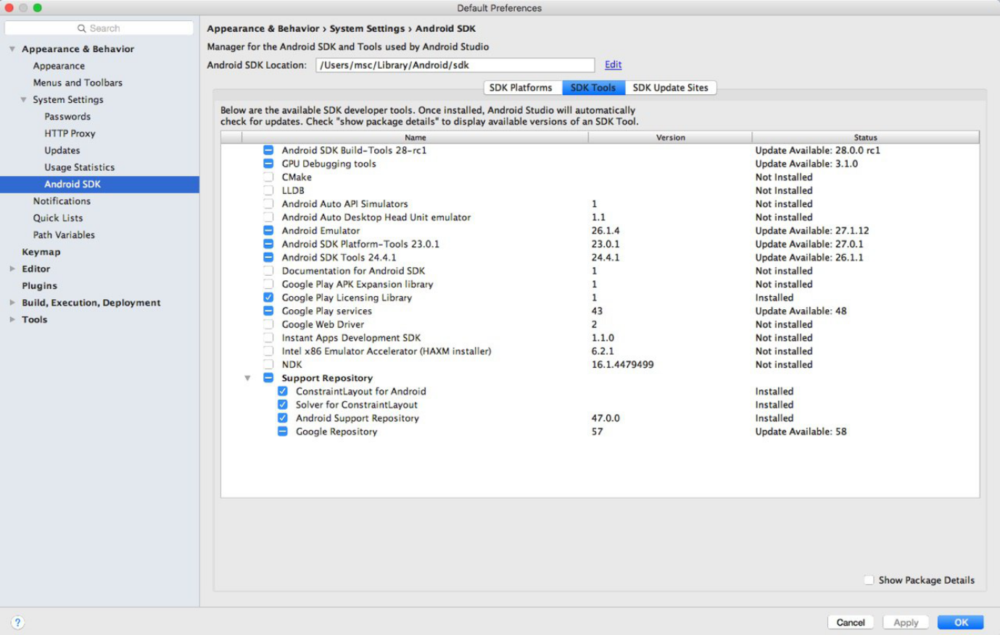
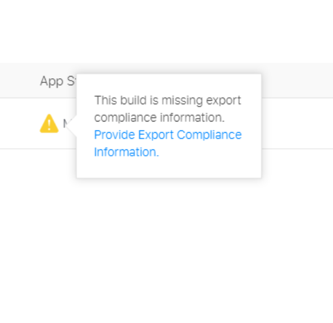
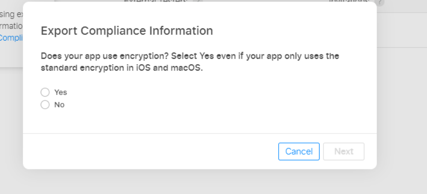

### Setup environment
> To setup your environment please follow next steps

1. Install **Node JS v7.5.0** or higher from https://nodejs.org/en
 
2. Download web-server Apache from apache-ant-1.9.9-bin.zip
    - 2.1.  Extract it to the folder
    - 2.2.  Add the bin directory path (for example, `C:\NAME\bin`) into the system variable `PATH`. You can do this in the windows settings - system variables `(My computer / properties / Additional System Parameters / Environments variables)`
 
3. Install **Java SE Development Kit v8** or higher from http://www.oracle.com/technetwork/java/javase/downloads/
    - 3.1. Create the system variable `JDK` and add the path of the JDK `bin` directory. The path must be in quotes.
Example: `C:\Program Files\Java\jdk1.8.0_111\bin`
 
4. Install **Android SDK** from https://developer.android.com/studio/
    - 4.1.  Create system variable `ANDROID_HOME` and add the path of the **Android SDK** directory. 
Example: `%AppData%\Local\Android\android-sdk\`
    - 4.2.  Add into system variable PATH next two values: `%ANDROID_HOME%\platform-tools`
    `%ANDROID_HOME%\tools`
    - 4.3 Replace `\tools`  
    https://dl.google.com/android/repository/tools_r25.2.5-macosx.zip   
    https://dl.google.com/android/repository/tools_r25.2.5-windows.zip   
    https://dl.google.com/android/repository/tools_r25.2.5-linux.zip   
replace path `tools`
 
5. Launch the command line as an Administrator and execute next commands:

        npm install -g cordova
        
npm install -g grunt-cli

        npm install –g gulp-cli
 
6. Install the Development Environment (WebStorm or Visual Studio)
 
7. Open the Google Chrome shortcut properties and add in the end of "Object" field through a space:
    
    
    --disable-web-security --user-data-dir --allow-file-access-from-files
    
Example value of the "Object" field: 
            
    "C:\Program Files (x86)\Google\Chrome\Application\chrome.exe" --disable-web-security --user-data-dir --allow-file-access-from-files
 
When starting the Google Chrome, this message should be displayed:
“you are using unsupported command line flag –disable-web-security. Stability and security will suffer”

8. Download the Project from repository

### Launching the Project
 

1. `npm i` (in the project root) If npm produces errors you need to install `yarn` -> `npm i -g` `yarn` and run `yarn install`   
    
    - `yarn run dev` OR `npm run dev` (in the project root)
   
    - `brew install ttfautohint fontforge --with-python
`    
    https://www.npmjs.com/package/grunt-webfont   
    - result link `http://localhost:8080/` in browser   

2. Open `Developer tools` (F12) and switch on the mobile phone emulation using Toggle device 

### Building the Application
> Launch the command line and go to the project root directory    
Execute one of following commands:  

Debug version (there is a sense for Android): `yarn run android`   
   -   Connect your phone via USB cable;   
   -   Enable Developer Mode on the phone;   
   -   Your phone appears in the `Remote devices` in the Google Chrome   

   -   You will be able to debug the application in the browser
> Note : `android-armv7-debug` is suitable for 99% of phones. But there are some special phones with Intel processors and they need the x86 install

##### Release version:  
`cordova build --release` (for both platforms). Need the signature! 
When launching on Mac OS, builds files for both platforms. On Windows you will have an error (this command is not relevant without iOS)

   
`yarn run android-r` (.apk for Android). To build the releases you need the keys to sign the applications. You can sign them when building or when uploading to the Google Play.
> Details: https://support.google.com/googleplay/android-developer/answer/7384423?hl=en   

`yarn run ios-r` (.xcodeproj for iOS). You need the MAC OS (virtual machine or mac) to build application for iOS.
This command is not relevant without iOS.
> Build details: https://cordova.apache.org/docs/en/latest/

##### For iOS:
You need the MAC OS (virtual machine or mac) to build application for iOS.
In Xcode ( https://itunes.apple.com/ru/app/xcode/id497799835?mt=12 ) open  
`\{project}\platforms\ios\{nameProject}.xcodeproj`

For the testing the application is convenient to upload in the TestFly (App Store).
In that case you need a web-developer account ( https://developer.apple.com/ “Account” section). In your account you need to create a web-application certificate.
Then go to iTunes account, create a project and specify the created certificate.
When building in the Xcode you have to specify the web-developer account and import the certificate.
After building you can upload your application in the App Store. The application must to be bound to TestFly.

Details about accounts and signatures:  https://developer.apple.com/support/development/
How to add the certificate to the Xcode: https://developer.apple.com/library/content/documentation/IDEs/Conceptual/AppDistributionGuide/MaintainingCertificates/MaintainingCertificates.html
> NOTE: if automatically signature in Xcode can't work need use manually signature

##### For Android:
After the build, the file is located

`\{project}\platforms\android\build\outputs\apk\android-armv7-release-unsigned.apk`   
You able to download it into the phone, install and perform tests

**Note!**  
If `Cordova` returns an error, you need to check the settings in the Android studio

If the versions of android sdk tools and android sdk platforms-tools are different - please follow the instructions: 
https://stackoverflow.com/questions/9555337/how-to-downgrade-my-sdk-versio

Information about create accounts, applications, keys and how to sign apk:   
https://support.google.com/googleplay/android-developer/answer/113469?hl=en   
https://support.google.com/googleplay/android-developer/answer/7384423?hl=en

**NOTE:**
1. change `version` and `versionCode`   
    - android - `\{project}\projects\Gerc\config_wallet.js` options - `version` and `versionCode`
    - ios - in Xcode general project page   
project root directory must contain a file `keyHockeyApp.js`
 file contents  
 `
module.exports = '9187cd3340b54ac1870e228fe5cd199b';`   
 

2. this is your key code for https://rink.hockeyapp.net    

3.directory `\{project}\projects\Gerc\` must contain key file for Android build signature `{name}.keystore`    
- You can configure the connection of this file in `\{project}\projects\Gerc`

4. ios app icon to meet the following criteria https://developer.apple.com/design/human-interface-guidelines/ios/icons-and-images/app-ic
5. if you see in itunes connect   
   
need click and change “NO”   
   

## Архитектура платформы

- ES6
- Vue2
- Vuex
- OnsenUI2

`build_apk` -
в эту папку копируются собраные сборки

`docs` -
документация по проекту

`libs` -
розличные api клиенты 

`plugins_mwallet` -
плагины или node модули, измененные или написанные нами

`projects` - 
здесь создаем через cordova проекты.  
`.config.mwallet.js` это базовая конфигурация для кошелька   
в каждой папке проекты есть файл `.config.app.js` который хранит в себе конфигурацию  
 кошелька для различных сред `SIT UAT PROD`  
 так же здесь хранится ключ для подписания cборки + `build.json` хранит пароли для ключа которым подписывается приложение  
 
 `ОЧЕНЬ ВАЖНАЯ ВЕЩЬ: кошелек создаем с именем которое будет в продеи после создание и добавление платформ config.xml имзенять запрещено`
 
`src` - содержит в себе компоненты, стили, длирективы, фильтры, картинки, языки, модули, старницы, и стор 
в принципе все понятно по названиям папок 

в страницах у нас реализована уникальаня вещь `реест страниц register.js`
// TODO:

##### Идея заключается в том, что бы, всю сложность API и конфигурацию каджого кошелька - вынести отдельно от написания логики старницы.

На страницах мы реализовываем только функции поведения `UI` 
(рендер списков, обработка кликов и т.д)

На примере работы с мастерпас, у нас, что бы сделать оплату или перевод выглядит все примерно так: 

что бы этого не делать, в каждоый странице, где есть оплата, пишется модуль для STORE 
и в нем уже происходит обработка всех шагов,
на странице это выглядит так 

    const result = await this.buyProduct(data);
ничего лишнего в коде =)
а все что происходит в модулях STORE ни кого не должно волновать))

##### данный механихм позволяет написать один раз модуль и он будет работать всегда!

#### STORE
STORE у нас не только в качестве хранения данных но и
 выступает в качестве медитора(посредника) между вызовами различных API 

почти в каждом action у нас выполняется:
 - проверка на подключение к интернету
 - получение данных 
 - сохранение в state 
 - сохранение в indexedDb (localforage)
 - обработка ошибок
 
 Для того что бы понимать как все работает 
 нужно хорошо розбираться в `Promises`
и в синтаксису `async/await`

____

Если к примеру, у нас есть `mWallet` клиент `(api)`
к нему будут подключены различные сервисы,
некоторые механизмы форматирование остаются вшитыми в апи клиенте, 
на примере загрузка карт:

____

### Сборка
#### Android
##### Релиз версия
Cобирает сборку + минифицирует код, подписывает, сохраняет `NAME.apk` в папку `build_apk` и заливает в `HockeyApp`

    yarn "android r"  

##### Дебаг версия
Cобирает сборку, сохраняет `NAME-debug.apk` в папку `build_apk`

    yarn "android"  

---
#### IOS
##### Релиз версия
Сообирает проект + минифицирует код в папку `wwww`, заменяет имя проекта, версию, `bundleID` 
затем необзодимо собрать сборку через `Xcode`

    yarn "ios r"  

##### Дебаг версия
Сообирает проект + минифицирует код в папку `wwww`, заменяет имя проекта, версию, `bundleID` 
затем необзодимо собрать сборку через `Xcode`

    yarn "ios"  

-----

### Создание иконок для кошельков
после того как будут добавлены платформы в проект, необзодимо создать иконки в 
папке 

    CORE/img/NAME/icon-ios.png
    CORE/img/NAME/icon-android.png

`IOS - 1024x1024` 
`ANDROID - 512x512`

    grunt 'build:gm_picturefill:android'
    grunt 'build:gm_picturefill:ios'
    
-----

### Создание SplashScreens
после того как будут добавлены платформы в проект, необзодимо создать картинку в 
папке   
если будет ошибка на маке, надо установить https://github.com/aheckmann/gm/wiki/Installing-ImageMagick---GraphicsMagick  

    CORE/img/NAME/splash.png

`IOS,ANDROID - 2048x2048`

    grunt build:phonegapsplash:all

-----

### Обновление плагинов
обновление плагинов в кошельке через https://github.com/dpa99c/cordova-check-plugins

    npm install -g cordova-check-plugins
    cd projects/NAME/
    cordova-check-plugins --update=auto

-----
